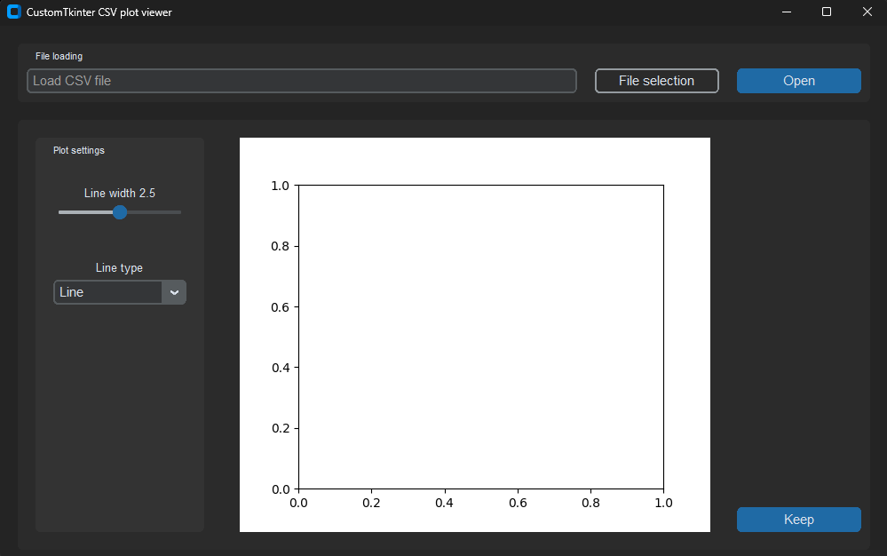
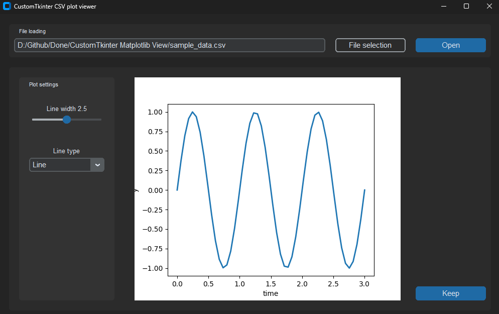
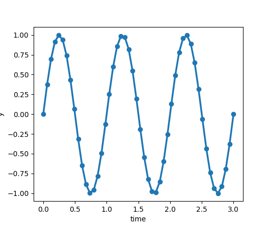

# CTk CSV Plot Viewer

### **A Python-based _simple customtkinter csv matplotlib view_ using CustomTkinter GUI and CSV**

Tkinter is a Python binding to the Tk GUI toolkit. It is the standard Python interface to the Tk GUI toolkit, and is Python's defacto standard GUI.


## Overview

CustomTkinter is a python UI-library based on Tkinter, which provides new, modern and fully customizable widgets. They are created and used like normal Tkinter widgets and can also be used in combination with normal Tkinter elements. The widgets and the window colors either adapt to the system appearance or the manually set mode ('light', 'dark'), and all CustomTkinter widgets and windows support HighDPI scaling (Windows, macOS). With CustomTkinter you'll get a consistent and modern look across all desktop platforms (Windows, macOS, Linux).

**A project to build a Python-based simple customtkinter csv matplotlib view app system to show plot by providing datasheet and store that plot as image png format.**


## Technologies Used

### **Tkinter**
Tkinter is Python’s standard GUI library used for building cross-platform desktop applications.

### **CustomTkinter**
[CustomTkinter](https://github.com/TomSchimansky/CustomTkinter) extends Tkinter with:

- Modern, consistent design  
- Light & Dark themes  
- High-DPI scaling  
- Fully customizable modern widgets  

Together, they ensure a smooth UI experience on **Windows**, **macOS** and **Linux**.

| Component | Description |
|------------|--------------|
| **Language** | Python 3.x |
| **Data Format** | [CSV](https://docs.python.org/3/library/csv.html) |
| **GUI Framework** | CustomTkinter |
| **Core Libraries** | Tkinter, CustomTkinter |


## Features

- Add csv file for get output
- Generate matplot view base on csv data
- Set multiple matplot line type or shape
- Save output plot as png image format
- Modern dark/light theme using CustomTkinter 
- Lightweight, responsive, and minimal design  
- Cross-platform support (Windows, macOS, Linux)


## Installation Steps

### Step 1. Clone the repository

```bash
git clone https://github.com/iamx-ariful-islam/CTk-CSV-Plot-Viewer.git
cd CTk-CSV-Plot-Viewer
```

### Step 2. Install Python Dependencies

The `requirements.txt` file, lists of all the Python libraries that "**_ctk csv plot viewer_**" depends on and installs those packages from the file:

```bash
pip install -r requirements.txt
# or (Linux/MacOS)
sudo pip install -r requirements.txt
```

### Step3. Run the Application
```bash
python main.py
```


## Folder Structure
Here’s the structure of the **CTk CSV Plot Viewer** project:

```bash
CTk-CSV-Plot-Viewer/
│
├── screenshots/
├── main.py
│── LICENSE
├── README.md
└── requirments.txt
```


## Screenshots

Here are some screenshots of the `CTk CSV Plot Viewer` project:

**Main Window**<br/>
<br/>
**Output - Main Window**<br/>
<br/>
**Output - PNG Format**<br/>



## Contributing

Contributions, suggestions, and feedback are always welcome! ❤️<br/>
To contribute:

1. Fork the repository
2. Create a new branch (`feature/new-feature`)
3. Commit your changes
4. Push and submit a Pull Request

💬 You can also open an issue if you’d like to discuss a feature or report a bug.


## For more or connect with me

<p align='center'>
  <a href="https://github.com/iamx-ariful-islam"></a>&nbsp;&nbsp;
  <a href="https://bd.linkedin.com/in/iamx-ariful-islam"></a>&nbsp;&nbsp;
  <a href="https://x.com/mx_ariful_islam"></a>&nbsp;&nbsp;
  <a href="https://www.facebook.com/iamx.ariful.islam/"></a>
</p>


## License

The [MIT](https://choosealicense.com/licenses/mit/) License (MIT)


## 💖 Thank You for Visiting!

> “Good design is about making things simple yet significant”  
> — *Md. Ariful Islam*